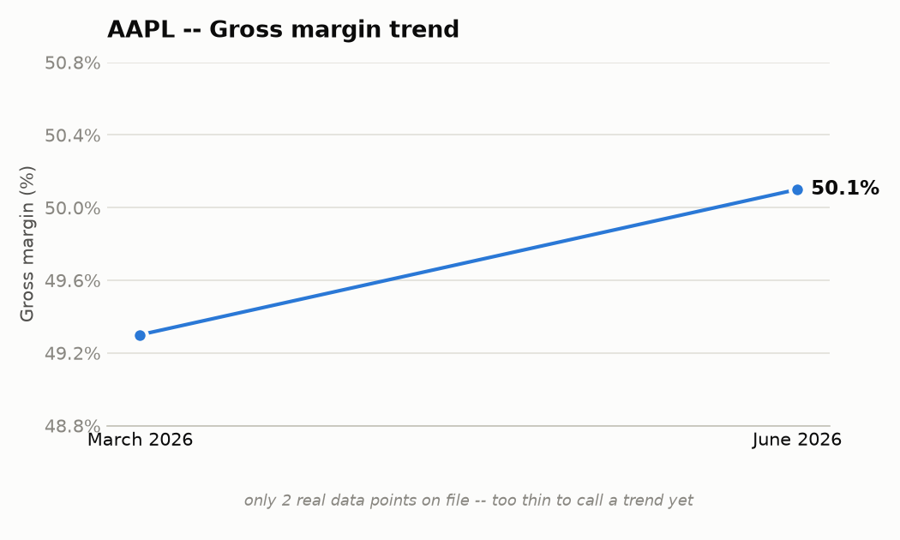

# Apple Inc. (AAPL) — June quarter 2026 — Quick Summary

_Early build of the template in `summary_template.md`, hand-assembled from real data (no new
extraction/matching code written yet — that's the open work the spec calls out). Every number
below is a real fact from `output/AAPL_Q3_2026_facts.json` / `_snapshot.md` (fact IDs shown) or
a real MarketDataLibrary row; nothing is invented. Where a section's designed data source isn't
usable yet, that's stated plainly rather than silently backfilled from somewhere else._

## 1. Headline scoreboard

| Metric | Actual (June qtr) | vs. prior guidance |
|---|---|---|
| Revenue | $109.40B (+16% yoy) | not available — no AAPL call before this one in the dataset |
| EPS | $2.02/sh (+29% yoy) | not available |
| Gross margin | 50.1% (+80 bps qoq) | not available |
| Operating cash flow | $34.40B | — |

`AAPL_2026_3-001`, `AAPL_2026_3-013`, `AAPL_2026_3-006`, `AAPL_2026_3-015`

*The chart shows yoy deltas as stat tiles — the real comparison available today, not the
actual-vs-guided delta bars the template design calls for. That "vs. prior guidance" column
is designed to compare this quarter's actual against what was guided into it last call — the
existing `trajectory` logic in `snapshot.py` already does this comparison, it just needs the
prior quarter's AAPL call in the gold set to populate it.*

## 2. Business segments

| Segment | Revenue | Growth (yoy) | Gross margin |
|---|---|---|---|
| iPhone | $54.30B | +22% | — |
| Mac | $10.40B | +29% | — |
| iPad | $6.20B | -6% | — |
| Wearables, Home & Accessories | $7.90B | +6% | — |
| Services | $30.70B | +12% | 75.6% |

*Source note: this table is 100% transcript-extracted, not from MarketDataLibrary's
`segments` table — checked directly, AAPL has no `Revenue by Segment` category in `segments`
at all (only Revenue by Geography / EBIT by Geography / Gross Profit / Key Performance
Indicators). This is the real, current state, not a placeholder — for AAPL, this section
runs on the extractor alone.* `AAPL_2026_3-003`, `AAPL_2026_3-016`, `AAPL_2026_3-017`,
`AAPL_2026_3-018`, `AAPL_2026_3-005`, `AAPL_2026_3-010`

Mac and iPhone both grew on what management called "an incredibly strong iPhone and Mac
product cycle" with demand "beyond our expectation," while iPad declined on a difficult
compare against last year's iPad launch. Services set records "in every category," per
management, despite a 110bp sequential gross-margin dip attributed to product mix.

## 3. Margin trend

*Both points are transcript-reported, not from MarketDataLibrary — `financials` is annual
(FY) + TTM only today, not quarterly, so a real trailing-quarters margin trend isn't
buildable from the DB yet. Two points is too thin to call a "trend" honestly; this section
will only become useful once either quarterly financials exist or enough consecutive real
calls accumulate in the gold set.*

## 4. Capital allocation

| Use of cash | Amount (June qtr) |
|---|---|
| Dividends paid | $4.00B |
| Share repurchases | $25.80B |
| **Total capital returned** | **$33.00B** |
| CapEx | not stated as a quarter figure on this call |
| M&A | not stated as a quarter figure — a >$30B multi-year Broadcom silicon agreement was announced (strategic commitment, not a booked quarterly cash outflow) |

`AAPL_2026_3-021`, `AAPL_2026_3-022`, `AAPL_2026_3-023`

*Designed source is `cash_flow`'s Financing + Investing Activities (which would also give
real CapEx and M&A cash flows, not just what a call happens to mention) — not usable yet:
MarketDataLibrary's `cash_flow` only has the Operating Activities table for ~5,035 of 5,039
symbols (confirmed on AAPL directly: 11 line items, all Operating Activities). This is a new
finding from tonight, same root cause as the balance_sheet gap, not yet fixed. Until it is,
this section is whatever capital-return figures the call states — real, but partial.*

## 5. Balance sheet snapshot

| | June quarter |
|---|---|
| Cash & securities | $147B |
| Total debt | $84B |
| Net cash | ~$63B |

`AAPL_2026_3-019`, `AAPL_2026_3-020`

*Designed source is `financials`' balance_sheet statement — not usable yet: AAPL is one of
the ~5,042 symbols still missing the Liabilities/Equity sections (fix exists —
`refetch_balance_sheet_liabilities.py` in MarketDataLibrary — not yet run at scale). Figures
above are transcript-stated instead.*

## 6. Forward guidance (September quarter)

| Metric | Guided |
|---|---|
| Revenue growth (yoy) | 9% to 11% |
| Gross margin | 47% to 48% |
| Operating expenses | $19.10B to $19.40B |
| Tax rate | ~16.5% |
| FX impact on revenue | ~2.5 pp unfavorable (total company) |

`AAPL_2026_3-025`, `AAPL_2026_3-029`, `AAPL_2026_3-031`, `AAPL_2026_3-033`, `AAPL_2026_3-024`

Both revenue growth (16% → 9-11%) and gross margin (50.1% → 47-48%) are guided down from
this quarter's actuals — the existing trajectory logic already flags both as "decelerating"
and "lower" respectively.

## 7. Competitive environment

Management cited third-party data (IDC) claiming share gains in both iPhone and Mac during
the quarter: *"According to IDC, we gained share globally during the quarter"* (iPhone) and
the same claim for Mac. On Mac specifically, management added color on displacement:
*"about half of the MacBook Neo large purchases by U.S. education institutions displaced
Windows and Chromebook devices."*

## 8. Product development

Headline item: a from-scratch Siri AI rebuild ("a completely reimagined version of Siri...
integrated seamlessly across our platforms"), alongside new MacBook Neo and iPhone 17
hardware cited as demand drivers, AirPods Pro 3/Max 2, a new "Apple Upgrade" hardware-leasing
program (with Klarna), and a >$30B multi-year custom-silicon agreement with Broadcom under
Apple's U.S. manufacturing program.

## 9. Macro / regulatory

- **Tariffs**: a net tailwind this quarter ($0.11/sh EPS benefit, ~2pp gross margin benefit),
  expected to shrink to ~1pp of margin benefit next quarter — management explicit that
  "we'll see decreasing benefit from this over time."
- **FX**: a growing headwind — ~2.5pp this quarter's Services guide, ~5pp cited for the
  broader March-to-September stretch.
- **Supply/memory costs**: flagged as worsening into the September quarter — "less
  flexibility in the supply chain than normal," with memory cost cited as the primary driver
  of the margin guide-down (more explanatory than FX, per management's own attribution).
- **Regulatory**: the only region-specific friction mentioned is the EU, where Siri AI
  hasn't shipped yet — *"we have not been able to do that in the European Union."*

---

## What this demonstrates, and what's still open

**Works today, real data, no placeholders**: headline numbers, business segments (transcript
side), forward guidance, competitive environment, product development, macro/regulatory —
sections 1, 2 (partial), 6, 7, 8, 9.

**Chart rendering built 2026-09-22 (`charts.py`, `py charts.py --demo` regenerates all five
PNGs in this doc).** All five chart-bearing sections now render real, not-hand-drawn charts
from the same numbers already in this doc's tables — including sections 3-5, which are still
data-limited (see below), so their charts are honestly thin/partial rather than faked full.
Palette and color usage (categorical for true nominal categories like capital-allocation uses;
status green/red reserved for actual good/bad readings like segment growth direction or net
cash vs. debt; a labeled gray "not stated" bar rather than a fabricated number for CapEx/M&A)
follow the dataviz skill's validated default. Pixel-level polish (rounded bar caps, the 2px
inter-bar gap spec) was skipped as not worth the complexity for a local static-PNG report;
the substantive checks (correct color job, direct value labels, recessive gridlines, a table
next to every chart as the accessible alternative) are all honored.

**Still blocked on MarketDataLibrary fixes that exist but haven't run at scale**: margin trend
(needs quarterly financials, which don't exist in any form yet — bigger lift), capital
allocation (needs the `cash_flow` Financing/Investing gap fixed — not yet written), balance
sheet snapshot (fix written, not yet run) — sections 3, 4, 5. The charts for these sections
are real, but only as good as the transcript-only data feeding them today.

**Not started**: the actual sentence-to-segment matching engine that would replace this
hand-assembly with real code (deliberately deferred again this session in favor of the chart
work — still the real remaining engineering item for section 2).
