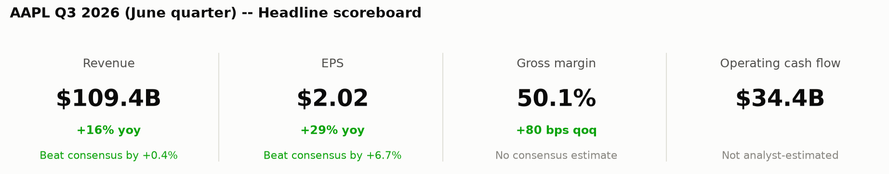
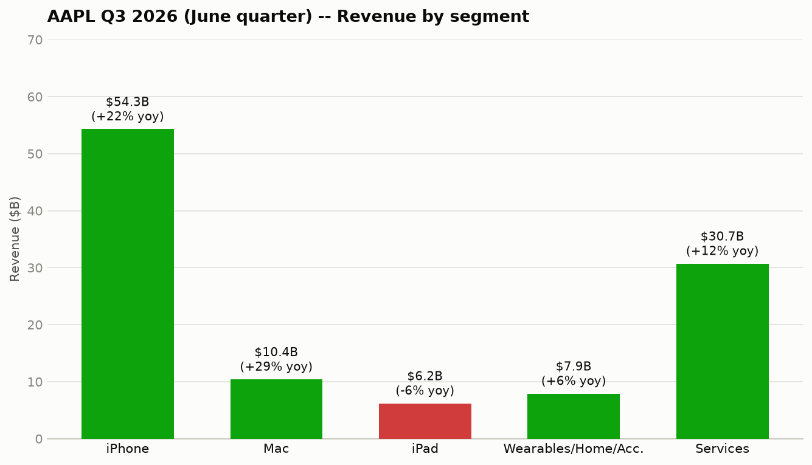
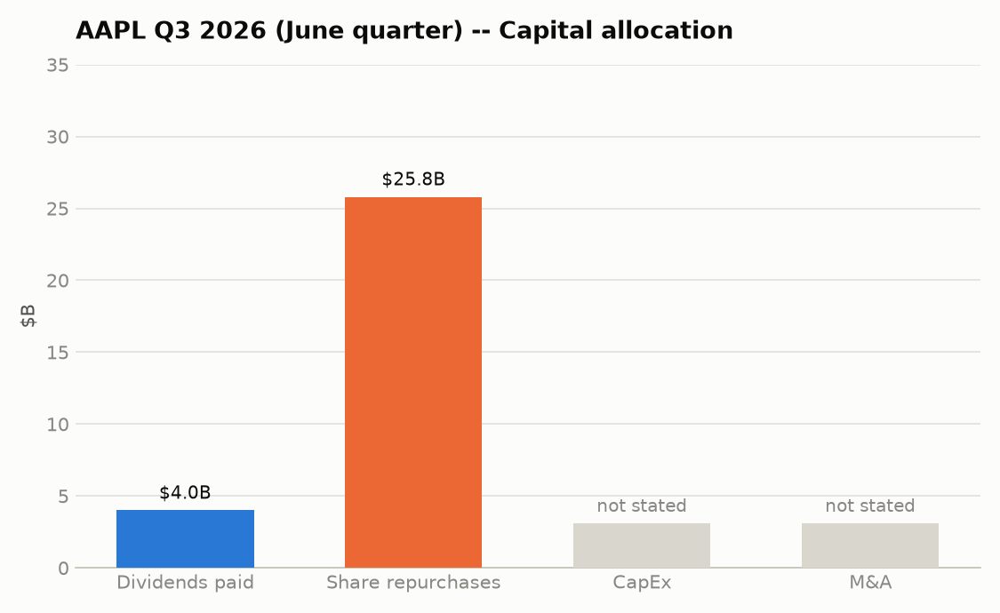
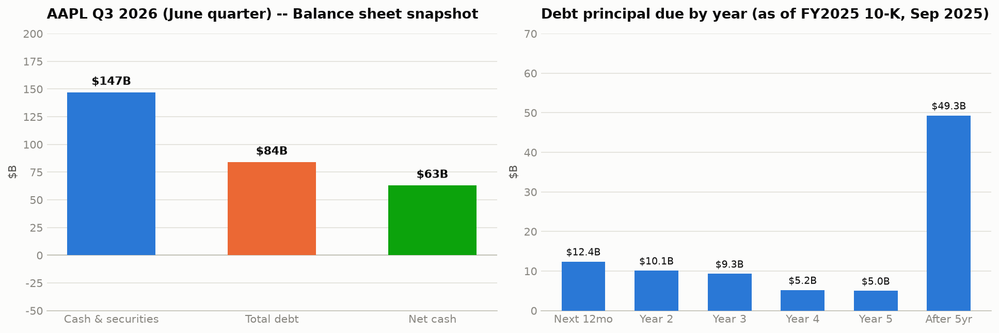

# Apple Inc. (AAPL) — June quarter 2026 — Quick Summary

## 1. Headline scoreboard

## 2. Business segments

| Segment | Revenue | Growth (yoy) |
|---|---|---|
| iPhone | $54.30B | +22% |
| Mac | $10.40B | +29% |
| iPad | $6.20B | -6% |
| Wearables, Home & Accessories | $7.90B | +6% |
| Services | $30.70B | +12% |

Transcript-extracted (not in MarketDataLibrary for AAPL). Apple doesn't disclose
margin by hardware segment, so it's left out rather than estimated.

**What's driving each segment:**

- **iPhone** (+22%): strong product cycle. New iPhone 17 is the driver.
- **Mac** (+29%): same strength, plus MacBook Neo — also behind the
  education-channel displacement in Competitive environment.
- **iPad** (-6%): a tough compare against last year's launch, not demand.
- **Wearables, Home & Accessories** (+6%): modest, no driver called out.
- **Services** (+12%, 75.6% margin, -110 bps sequentially on mix): records in
  every category. Company-wide margin still rose to 50.1% (+80 bps qoq)
  despite Services' dip — likely hardware mix/ASPs elsewhere.

## 3. Capital allocation

| Use of cash | Amount (June qtr) | vs. year-ago quarter |
|---|---|---|
| Share repurchases | $25.80B | +19.1% |
| Dividends paid | $4.00B | +2.3% |
| CapEx | $2.46B | -29.1% |
| Debt repaid | $0.23B | -95.9% |
| Debt issued | $0 fiscal-year-to-date | — |

Total returned to shareholders (dividends + buybacks): **$29.80B**.

**M&A**: not charted, since a pie slice implies a completed cash outflow. AAPL's
SEC filings show $0 in acquisitions cash flow this fiscal year — consistent with
the >$30B multi-year Broadcom custom-silicon agreement being a forward supply
commitment, not a completed purchase.

## 4. Balance sheet snapshot

| | June quarter |
|---|---|
| Cash & securities | $147B |
| Total debt | $84B |
| Net cash | ~$63B |

Total debt edged down this quarter: AAPL repaid $232M more than it issued (see
Capital allocation), with no new debt issued in the period.

**When it's due**: $12.4B of principal matures in the next 12 months, $10.1B in
year two, $9.3B in year three, tapering to $5.2B and $5.0B in years four and
five, with $49.3B due after that — a maturity schedule weighted toward the
long end, so near-term refinancing risk is limited. This is the aggregate
principal-by-year figure AAPL files with the SEC; individual notes (coupon,
specific maturity date) aren't broken out at that level in this data.

## 5. Insider activity

**June quarter (2026-03-29 to 2026-06-27): $152.4M in insider stock sales, zero
insider purchases.**

| Insider | Title | Shares sold | Value | Avg. price |
|---|---|---|---|---|
| Arthur D. Levinson | Director | 300,000 | $86.74M | $289.14 |
| Timothy D. Cook | CEO | 131,576 | $33.54M | $254.94 |
| Deirdre O'Brien | SVP | 64,317 | $16.43M | $255.50 |
| Sabih Khan | COO | 33,317 | $8.52M | $255.63 |
| Jennifer Newstead | SVP, General Counsel | 16,238 | $4.81M | $296.42 |
| Kevan Parekh | CFO | 6,327 | $1.70M | $268.51 |
| Ben Borders | Principal Accounting Officer | 2,406 | $0.68M | $281.84 |

Most of this coincides with scheduled RSU-vesting dates for Cook, O'Brien, Khan,
Newstead, Parekh, and Borders — routine tax-withholding or plan-based sales, not
a fresh decision to sell. The exception is Director Arthur Levinson, whose
$86.7M sale has no corresponding equity award that quarter, making it the more
standalone data point. No insider bought shares on the open market this quarter.

## 6. Forward guidance

| Metric | Guided (September qtr) | Analyst consensus | vs. consensus |
|---|---|---|---|
| Revenue growth (yoy) | 9% to 11% | +10.9% ($113.62B est.) | At top of range |
| Gross margin | 47% to 48% | — (no consensus field) | — |
| Operating expenses | $19.10B to $19.40B | — | — |
| Tax rate | ~16.5% | — | — |
| FX impact on revenue | ~2.5 pp unfavorable | — | — |

Revenue is the one line with a real Street number to check against: analysts already
expected +10.9% yoy growth (implied by their $113.62B consensus vs. last September
quarter's actual $102.47B) — right at the top of AAPL's own 9-11% guided range. That
reads as guidance roughly confirming what was already priced in, not a clear raise or
lower. No consensus exists for margin, opex, tax rate, or FX impact, so those rows
are left blank rather than guessed.

## 7. Competitive environment

AAPL reported IDC-sourced share gains in both iPhone and Mac this quarter —
third-party data, directional rather than precise. On Mac, roughly half of
MacBook Neo's large-purchase volume with U.S. education institutions displaced
Windows and Chromebook devices, a channel where Apple has historically been a
distant third choice. If it holds across future quarters, it points to Mac's
competitive position genuinely strengthening there; one quarter isn't enough to
call it a durable trend yet.

## 8. Product development

- **Siri AI rebuild** — a from-scratch redesign integrated across Apple's
  platforms. The most consequential software item this quarter: Siri's AI
  competitiveness has been a recurring criticism, so this is Apple's direct
  answer to it. Not yet available in the EU (see Macro/regulatory).
- **MacBook Neo** — new hardware driving Mac's +29% yoy growth and the
  education-channel displacement noted above.
- **iPhone 17** — new hardware driving iPhone's +22% yoy growth.
- **AirPods Pro 3 / Max 2** — new audio hardware launched this quarter; no
  segment-level growth attribution was given.
- **Apple Upgrade** — a new hardware-leasing program with Klarna. A
  business-model move toward recurring revenue rather than a product launch —
  worth watching for its effect on future upgrade-cycle attach rates.
- **Broadcom custom-silicon agreement** — a >$30B multi-year commitment under
  Apple's U.S. manufacturing program. A supply-chain move, not a completed
  acquisition (see Capital allocation).

## 9. Macro / regulatory

- **Tariffs** — a net tailwind this quarter ($0.11/sh EPS benefit, ~2pp gross
  margin benefit), guided to shrink to ~1pp next quarter. Fading, not a new
  headwind yet.
- **FX** — a growing headwind: ~2.5pp on the Services guide, ~5pp across the
  broader March-to-September stretch. Negative for margin into next quarter,
  compounding the tariff tailwind's fade.
- **Supply/memory costs** — worsening into September, with memory cost the
  larger driver of the margin guide-down, ahead of FX. Could persist beyond one
  quarter if industry-wide memory pricing stays elevated.
- **Regulatory** — the EU is the one friction point: Siri AI hasn't shipped
  there yet, leaving Apple's most consequential software launch this quarter
  unavailable in one of its largest markets.

---

## Source documents

- [Full earnings call transcript](sample_AAPL_Q3_2026_transcript.txt)
- [10-Q filed with the SEC](https://www.sec.gov/Archives/edgar/data/320193/000032019326000020/aapl-20260627.htm)
  (period ended 2026-06-27, filed 2026-07-31)
