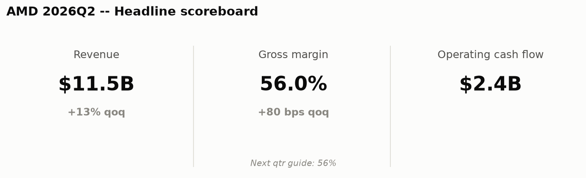
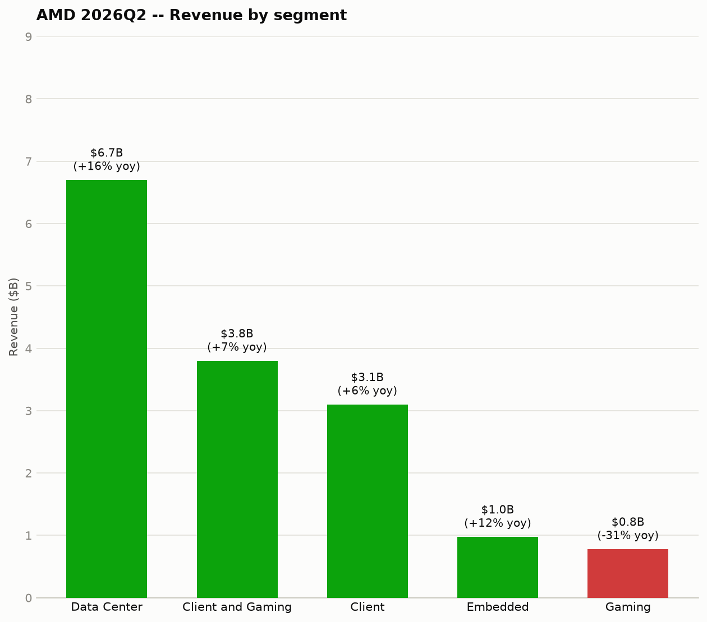
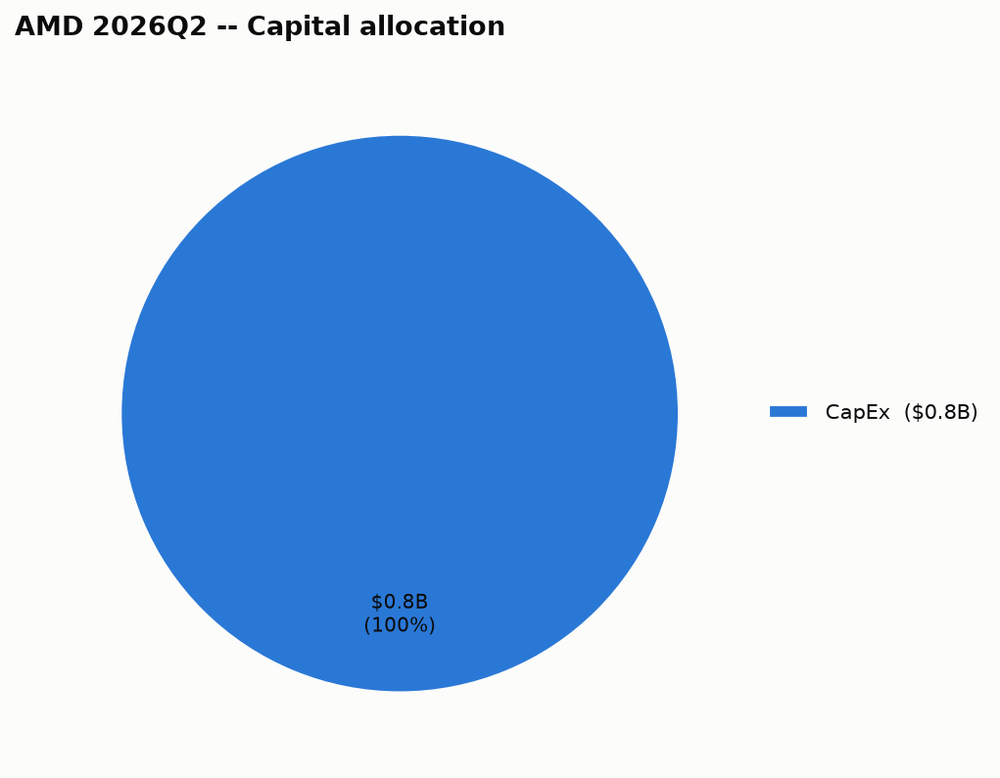

# Advanced Micro Devices Inc (AMD) — 2026Q2 — Quick Summary

## 1. Headline scoreboard

## 2. Business segments

| Segment | Revenue | Growth (yoy) |
|---|---|---|
| Data Center | $6.70B | +16% |
| Client and Gaming | $3.80B | +7% |
| Client | $3.10B | +6% |
| Embedded | $977.0M | +12% |
| Gaming | $779.0M | -31% |

Advanced Micro Devices Inc doesn't disclose gross margin by individual segment in this data, so it's left out rather than estimated.

## 3. Capital allocation

| Use of cash | Amount |
|---|---|
| CapEx | $808.0M |

## 4. Balance sheet snapshot

| | This quarter |
|---|---|
| Cash & securities | $13.10B |

**When it's due**: $875.0M in next 12mo, $750.0M in year 2, $625.0M in year 3, $0 in year 4, $750.0M in year 5, $1.00B in after 5yr — the aggregate principal-by-year figure Advanced Micro Devices Inc files with the SEC (as of 2025-12-27); individual notes (coupon, specific maturity date) aren't broken out at that level in this data.

---

## Source documents

- [Filing with the SEC](https://www.sec.gov/Archives/edgar/data/2488/000000248826000123/amd-20260627.htm) (period ended 2026-06-27, filed 2026-08-05)
