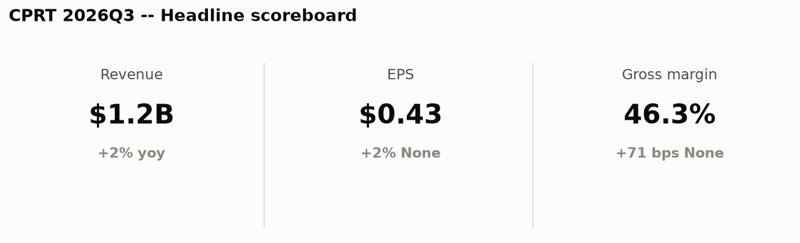
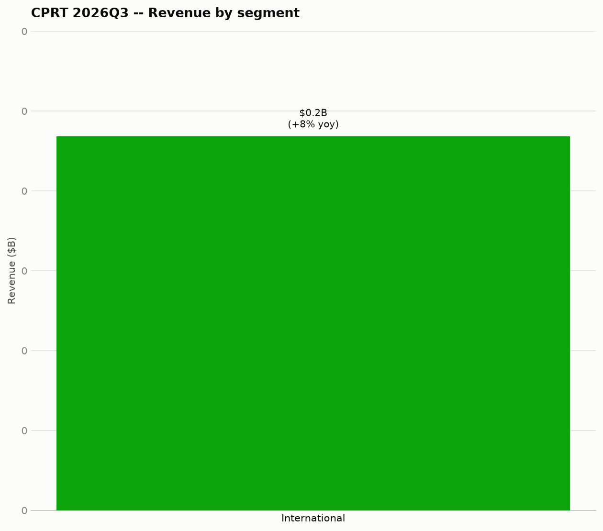
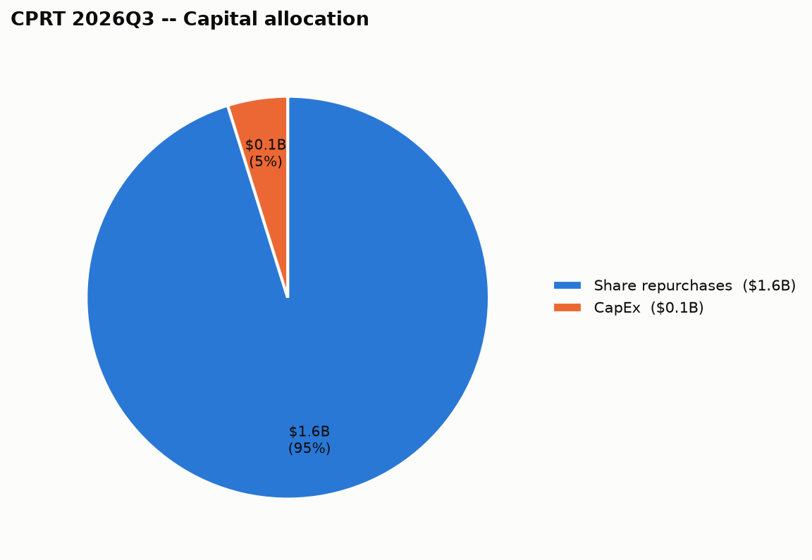

# Copart Inc. (CPRT) — 2026Q3 — Quick Summary

## 1. Headline scoreboard

## 2. Business segments

| Segment | Revenue | Growth (yoy) |
|---|---|---|
| International | $234.2M | +8% |

Copart Inc. doesn't disclose gross margin by individual segment in this data, so it's left out rather than estimated.

## 3. Capital allocation

| Use of cash | Amount |
|---|---|
| Share repurchases | $1.60B |
| CapEx | $80.9M |

Total returned to shareholders (dividends + buybacks): **$1.60B**.

## 4. Balance sheet snapshot

| | This quarter |
|---|---|
| Cash & securities | $4.20B |

**When it's due**: $0 in next 12mo, $0 in year 2, $0 in year 3, $218.8M in year 4, $0 in year 5 — the aggregate principal-by-year figure Copart Inc. files with the SEC (as of 2021-07-31); individual notes (coupon, specific maturity date) aren't broken out at that level in this data.

---

## Source documents

- [Filing with the SEC](https://www.sec.gov/Archives/edgar/data/900075/000119312526245578/cprt-20260430.htm) (period ended 2026-04-30, filed 2026-05-29)
