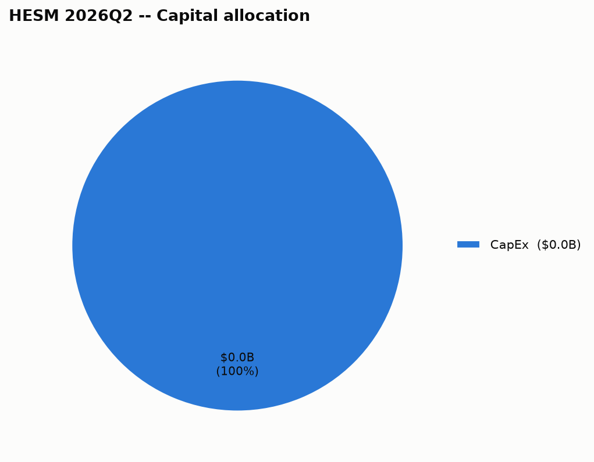

# Hess Midstream LP (HESM) — 2026Q2 — Quick Summary

## 3. Capital allocation

| Use of cash | Amount |
|---|---|
| CapEx | $23.1M |

---

## Source documents

- [Filing with the SEC](https://www.sec.gov/Archives/edgar/data/1789832/000119312526338055/hesm-20260630.htm) (period ended 2026-06-30, filed 2026-08-06)
