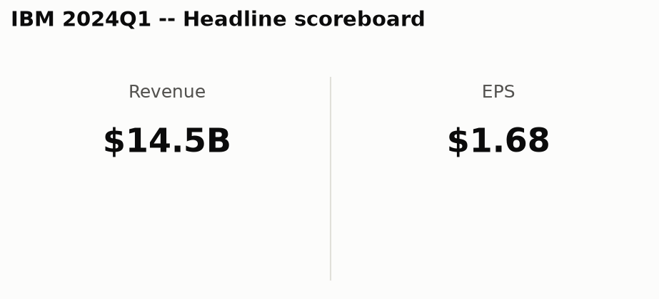
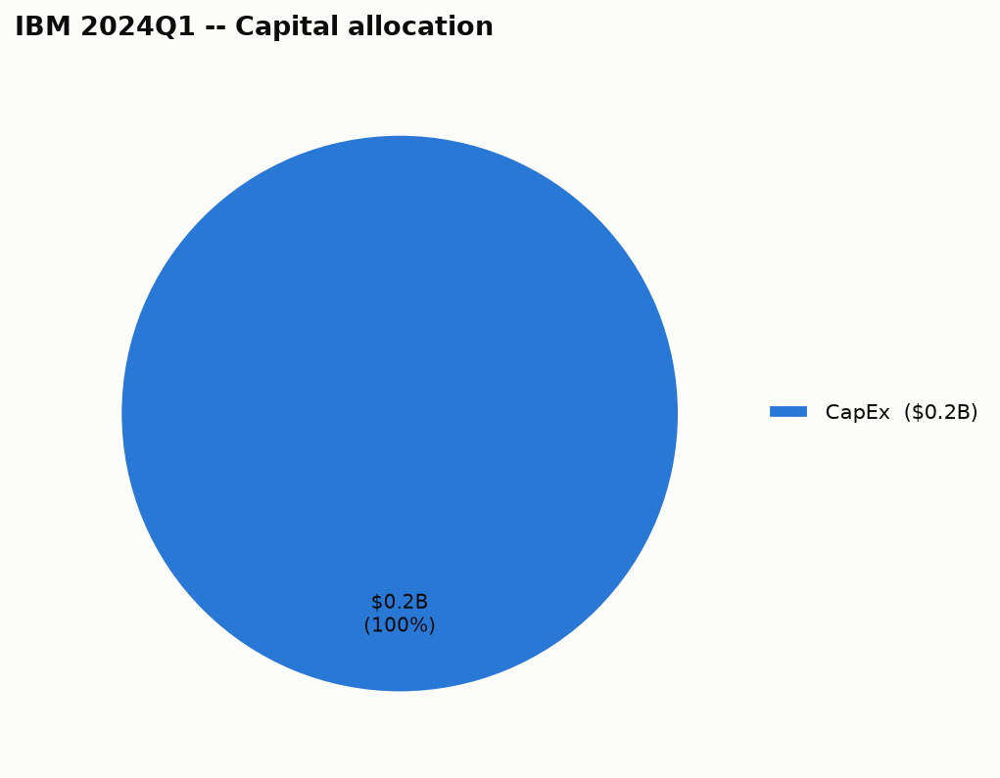

# International Business Machines Corp (IBM) — 2024Q1 — Quick Summary

## 1. Headline scoreboard

## 3. Capital allocation

| Use of cash | Amount |
|---|---|
| CapEx | $239.0M |

## 4. Balance sheet snapshot

| | This quarter |
|---|---|
| Total debt | $59.50B |

**When it's due**: $6.71B in next 12mo, $6.00B in year 2, $5.58B in year 3, $4.45B in year 4, $4.49B in year 5, $34.35B in after 5yr — the aggregate principal-by-year figure International Business Machines Corp files with the SEC (as of 2026-06-30); individual notes (coupon, specific maturity date) aren't broken out at that level in this data.

---

## Source documents

- [Filing with the SEC](https://www.sec.gov/Archives/edgar/data/51143/000005114324000025/ibm-20240331.htm) (period ended 2024-03-31, filed 2024-04-30)
